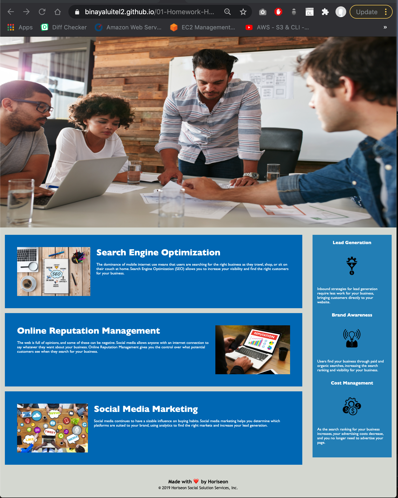

# 01-Homework-HTML-CSS
First assignment for HTML / CSS.

## Description:
As a part of this assignment we learned:
* How to modify HTML file
* How to modify css file
* How to properly comment HTML and CSS file
* How to push the changes to gitHub
* How to host the website using github

## Credits:

Kudos to Jason McGinthy, Emily Todt and Shauna Dunn. We worked together a team. So, there might be code matches between us.

## Link to the Deployed App

[link to Deployed App](https://binayaluitel2.github.io/01-Homework-HTML-CSS/)

## Screenshot of Deployed App

